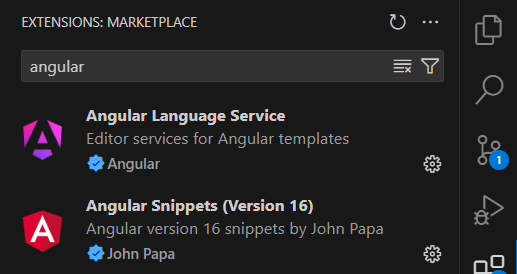

# ANGULAR
Angular es un framework de desarrollo de aplicaciones web creado por Google, que facilita la construcción de aplicaciones dinámicas y de alta performance mediante componentes reutilizables y un enfoque en la modularidad y la eficiencia.

Server-Side Rendering (útil para SEO.)

## IONIC
**Ionic** es un framework de código abierto para el desarrollo de aplicaciones móviles multiplataforma. Utiliza tecnologías web como HTML, CSS y JavaScript para crear aplicaciones que se ejecutan en iOS, Android y la web desde una única base de código. Ionic se integra muy bien con Angular, pero también soporta otros frameworks como React y Vue.

### ¿Por qué Ionic es apropiado si vienes de Angular?

1. **Compatibilidad Natural:** Ionic se integra perfectamente con Angular, ya que fue diseñado inicialmente para trabajar con Angular. Esto significa que puedes aprovechar tu conocimiento de Angular directamente en el desarrollo con Ionic.
   
2. **Componentes y UI:** Ionic proporciona una biblioteca rica de componentes de UI nativos, listos para usar y que siguen las directrices de diseño de iOS y Android. Esto permite que tus aplicaciones tengan una apariencia nativa y profesional sin necesidad de diseñar desde cero.

3. **Una Sola Base de Código:** Con Ionic, puedes desarrollar para múltiples plataformas (iOS, Android, web) utilizando una sola base de código, lo que ahorra tiempo y esfuerzo en el desarrollo y mantenimiento.

4. **Herramientas y Plugins:** Ionic ofrece una variedad de herramientas y plugins, como Capacitor (su solución de runtime), que facilita el acceso a funcionalidades nativas del dispositivo como la cámara, GPS, almacenamiento, etc.

5. **Desarrollo Rápido:** Aprovechar tus conocimientos de Angular te permite desarrollar más rápidamente ya que estás familiarizado con la estructura y las prácticas de desarrollo. 

En resumen, si ya conoces Angular, utilizar Ionic te permitirá crear aplicaciones móviles de manera eficiente, con una curva de aprendizaje mínima, y aprovechar al máximo tus habilidades y conocimientos actuales.

## PRIMEROS PASOS
Vamos a ver ANGULAR 16, ya que esa y sus versiones anteriores, muy parecidas, son, con alta probabilidad, las que nos encontraremos en el mercado laboral.

### Preparación entorno
Requiere:
- NodeJS para npm
- Angular CLI

Instalamos CLI de forma global:
https://www.npmjs.com/package/@angular/cli/v/16.2.14
```bash
npm install -g @angular/cli@16.2.14
```
Comprobamos la instalación:
```bash
ng version
```


### Hola mundo
Creamos directorio del proyecto.
Creamos nuevo proyecto desde la terminal, desde ese directorio:
```bash
ng new NombreProyecto
```

Nos preguntará varias cosas:
- autocompletado? no
- add Angular Routing? no
- cómo aplicarás estilos? CSS


Extensiones de VSCode recomendadas:

- Angular Language Service
- Angular Essentials (John Papa)


Una breve descripción del propósito de cada archivo en un proyecto Angular:

- **angular.json**: Contiene la configuración del proyecto Angular, incluyendo información sobre los proyectos, arquitecturas de construcción, pruebas, y opciones de configuración para el CLI de Angular.

- **package.json**: Define las dependencias del proyecto, scripts de ejecución, y metadatos del proyecto (como nombre, versión, descripción). Es crucial para la gestión de paquetes con npm.

- **package-lock.json**: Registra las versiones exactas de las dependencias instaladas en el proyecto, asegurando que se mantengan las mismas versiones en futuras instalaciones para mantener la consistencia del entorno de desarrollo.

- **tsconfig.json**: Configura las opciones del compilador TypeScript para el proyecto globalmente, como la versión de ECMAScript, los directorios de salida y las reglas estrictas de comprobación de tipos.

- **tsconfig.app.json**: Especifica configuraciones específicas de TypeScript para la aplicación Angular. Suele extender `tsconfig.json` y se usa principalmente para la construcción del código fuente de la aplicación.

- **tsconfig.spec.json**: Define las configuraciones de TypeScript para los archivos de pruebas (spec). Suele extender `tsconfig.json` y asegura que los tests se compilen correctamente.

Estos archivos configuran y gestionan diferentes aspectos del proyecto Angular, desde la construcción y dependencia hasta la configuración del compilador TypeScript.


En el archivo angular.json existen dos líneas, donde aparecen los puntos de entrada de la aplicación.
```json
            "index": "src/index.html",
            "main": "src/main.ts",
```

Contenido de main.ts
```ts
import { platformBrowserDynamic } from '@angular/platform-browser-dynamic';

import { AppModule } from './app/app.module';


platformBrowserDynamic().bootstrapModule(AppModule)
  .catch(err => console.error(err));

```

#### Estructura lógica de Angular

La aplicación Angular siempre inicializa un APP MODULE (el tronco).

A partir de ahí cuelgan los componentes, servicios

#### Crear un componente
```bash
cd AngularBasicos/

ng generate component introduccion/binding
```

Esto ejecuta los siguientes pasos:
- crea carpeta introduccion con los siguientes archivos
    - css
    - html
    - spec.ts (podemos borrarlo)
    - ts
- Añade el componente en el fichero del módulo padre.

Un componente es una clase (siempre).

Un componente no puede estar suelto. Tiene que estar dentro de un módulo. Si no especificamos, lo mete en el módulo por defecto que es app.

En **binding.component.ts** se define el componente:
```ts
import { Component } from '@angular/core';

@Component({
  selector: 'app-binding',
  templateUrl: './binding.component.html',
  styleUrls: ['./binding.component.css']
})
export class BindingComponent {

}
```

Para mostrar el componente en la página principal, en **app.component.html** añadimos lo siguiente:
```html
<app-binding></app-binding>
```

Esto renderizará el contenido de **binding.component.html**:
```html
<p>binding works!</p>
```


Comando live preview:
```bash
ng serve -o
```

-------------------------------------
Crear nuevo componente:
```bash
ng generate component introduccion/directivas
```
Versión abreviada:
```bash
ng g c introduccion/directivas
```


ngif
ngfor
ngswitch


Formularios
Pipes

2 técnicas para hacer formularios:
- por template (ngModel)
- reactivos (más modernos y más completos) ngForm

Crear un formulario:
```bash
ng g c formularios/formularioUsuarios
```

De esta forma podríamos meter el HTML dentro del componente, sin un HTML aparte:

```ts
import { Component } from '@angular/core';

@Component({
  selector: 'app-formulario-usuarios',
  // templateUrl: './formulario-usuarios.component.html',
  template: '<h1></h1>',
  styleUrls: ['./formulario-usuarios.component.css']
})
export class FormularioUsuariosComponent {

}
```

Pipes:

```bash
ng g c pipes/angularPipes
```
Ejemplo pipes HTML:
```html
<div class="container">
    <h3><a href="https://angular.io/api?query=pipe" target="_blank">Pipes en Angular</a></h3>
    <p>Pipes básicos de texto</p>
    <ul>
      <li>Original: {{nombre}}</li>
      <li>Pipe uppercase: {{nombre | uppercase}}</li>
      <li>Pipe lowercase: {{nombre | lowercase}}</li>
      <li>Pipe titlecase {{nombre | titlecase}}</li>
    </ul>
  
    <p><a href="https://angular.io/api/common/DatePipe" target="_blank">Pipe date</a></p>
    <ul>
      <li>Original: {{fechaActual}}</li>
      <li>{{fechaActual | date: 'short'}}</li>
      <li>{{fechaActual | date: 'mediumDate'}}</li>
      <li>{{fechaActual | date: 'dd/MM/yyyy'}}</li>
      <li>{{fechaActual | date:'MMMM dd, yyyy'}}</li>
      <li>{{fechaActual | date:'long':'GMT-4'}}</li>
      <li>{{fechaActual | date:'long':'':'fr' }}</li>
    </ul>
  
    <p>Pipes numéricos</p>
    <ul>
      <li>Original: {{facturacion}}</li>
      <li>{{facturacion | number:'1.2-2' }}</li>
      <li>{{facturacion | currency:'EUR':'symbol-narrow':'1.4-4' }}</li>
      <li>{{porcentaje | percent:'2.2-2'}}</li>
    </ul>
  
  </div>
  
```

Ejemplo pipes TS:
```ts
export class AngularPipesComponent {
  nombre = 'Juan Luis ochoa';
  fechaActual = new Date();
  facturacion = 1099898.5454;
  porcentaje = 0.21;

}
```

Configurar idioma:
```ts
// app.module.ts
// Cambiar el locale de la app. Cambiamos el idioma de la aplicación a nivel global
// Importar los idiomas deseados (por lo general será solo el castellano (es))
import localeEs from '@angular/common/locales/es';
import localeFr from '@angular/common/locales/fr';
// Ahora los registramos
import { registerLocaleData } from '@angular/common';

...

registerLocaleData(localeEs);
registerLocaleData(localeFr);
...

 providers: [{ provide: LOCALE_ID, useValue: 'es' }], // Configuramos el idioma por defecto de la app
 ```

Comandos para pipes personalizados
```bash
ng g c pipes/pipesPersonalizados
ng g p pipes/almacenamientoArchivos
ng g p pipes/almacenamientoArchivosMultiple
ng g p pipes/distancias
```


### Decoradores en Angular
En Angular, los decoradores son una característica de TypeScript que se utilizan para añadir metadatos a clases, métodos, propiedades o parámetros. Estos metadatos permiten que Angular entienda cómo las diferentes piezas de la aplicación deben comportarse y cómo deben interactuar entre sí.

1. **@Component**: Define una clase como un componente de Angular y proporciona metadatos sobre el selector, la plantilla, los estilos, etc.
   
   ```typescript
   @Component({
     selector: 'app-root',
     templateUrl: './app.component.html',
     styleUrls: ['./app.component.css']
   })
   export class AppComponent {
     title = 'mi-aplicacion';
   }
   ```

2. **@NgModule**: Define una clase como un módulo de Angular y proporciona metadatos sobre los componentes, directivas, pipes, y otros módulos que forman parte del módulo.
   
   ```typescript
   @NgModule({
     declarations: [
       AppComponent,
       OtroComponent
     ],
     imports: [
       BrowserModule,
       FormsModule
     ],
     providers: [],
     bootstrap: [AppComponent]
   })
   export class AppModule { }
   ```

3. **@Injectable**: Marca una clase como disponible para la inyección de dependencias.
   
   ```typescript
   @Injectable({
     providedIn: 'root',
   })
   export class DataService {
     constructor(private http: HttpClient) { }
   }
   ```

4. **@Directive**: Define una clase como una directiva estructural o de atributo.
   
   ```typescript
   @Directive({
     selector: '[appHighlight]'
   })
   export class HighlightDirective {
     constructor(private el: ElementRef) { }
   }
   ```

### Decorador @Pipe en particular

El decorador `@Pipe` se utiliza para definir una clase como un pipe de transformación en Angular. Los pipes transforman datos en plantillas, como formatear fechas, números, textos, etc.

#### Ejemplo de un pipe personalizado

1. **Definición del pipe**:
   
   ```typescript
   import { Pipe, PipeTransform } from '@angular/core';

   @Pipe({
     name: 'capitalize'
   })
   export class CapitalizePipe implements PipeTransform {
     transform(value: string): string {
       if (!value) return value;
       return value.charAt(0).toUpperCase() + value.slice(1).toLowerCase();
     }
   }
   ```

2. **Uso del pipe en una plantilla**:
   
   ```html
   <!-- Suponiendo que "nombre" es una propiedad con el valor "angular" -->
   <p>{{ nombre | capitalize }}</p> <!-- Salida: "Angular" -->
   ```

En resumen, los decoradores en Angular permiten definir cómo deben comportarse las distintas partes de una aplicación, mientras que el decorador `@Pipe` en particular se utiliza para crear pipes que transforman datos en las plantillas.


(Documentar pipes personalizados con ejemplos)


Creación de componente y servicio:
```bash
ng g c rest/recetas
ng g s services/recetas
```


Inyectable --> Servicio

rxjs: librería de MS para trabajar con llamadas a APIs (Tipo fetch pero mejor.). Angular lo incorpora desde hace tiempo.

```ts
import { HttpClient } from '@angular/common/http'; // Importa el servicio HttpClient para hacer peticiones HTTP.
import { Injectable } from '@angular/core'; // Importa el decorador Injectable para que este servicio pueda ser inyectado en otros componentes o servicios.
import { Observable } from 'rxjs'; // Importa Observable para trabajar con datos asíncronos.
import { IMeals } from '../interfaces/meal.interface'; // Importa la interfaz IMeals para tipar la respuesta de la API.

@Injectable({
  providedIn: 'root'
  // Indica que este servicio es un singleton y estará disponible en toda la aplicación.
  // Anteriormente se registraba en el módulo de Angular, pero ahora se hace con providedIn.
})
export class RecetasService {
  // El decorador @Injectable indica que este servicio puede ser inyectado en cualquier parte de la aplicación.
  // 'providedIn: 'root'' significa que el servicio es un singleton y estará disponible en toda la aplicación.

  constructor(private http: HttpClient) {}
  // El constructor inyecta el HttpClient en el servicio para permitir hacer peticiones HTTP.

  getRecetas(categoria: string): Observable<IMeals> {
    // Método que recibe una categoría como parámetro y devuelve un Observable de tipo IMeals.
    // Este método realiza una petición GET a la API de TheMealDB para obtener recetas filtradas por categoría.

    return this.http.get<IMeals>(`https://www.themealdb.com/api/json/v1/1/filter.php?c=${categoria}`);
    // Hace una petición GET a la URL de la API, incluyendo la categoría en la query string.
    // La respuesta de la API es tipada como IMeals.
  }
}

```

Incluir siempre el httpClientModule en el import de `app.module.ts`:

```ts
  imports: [
    BrowserModule,
    FormsModule,
    HttpClientModule
  ]
  ```

Dentro del método que llama a la API:
  - next - como try
  - error - como catch
  - continue - como finally

  ```ts

  getRecetas() {
    this.recetasService.getRecetas(this.categoriaSeleccionada).subscribe({
      next: (data: IMeals) => {
        console.log(data);
        this.recetario = data;

        this.mostrarError = false;
      },
      error: (err) => (this.mostrarError = true),
      complete: () => console.log('ok')
    });
  }

  ```

###### Módulo de enrutamiento:

Nuevo módulo para enrutar: generar módulo
```bash
ng g m appRouting
```
Me genera el módulo dentro de la carpeta app en una carpeta llamada igual que el módulo.
Por buenas prácticas, movemos el archivo `app-routing.module.ts` dentro de la carpeta `app`. Y borramos la carpeta que queda vacía.

En el archivo `app-routing.module.ts` agregamos lo siguiente, entre ello un array de rutas:
```ts
import { NgModule } from '@angular/core';
import { Routes, RouterModule } from '@angular/router';
import { HomeComponent } from './home/home.component';
import { NotFoundComponent } from './not-found/not-found.component';
import { BindingComponent } from './introduccion/binding/binding.component';
import { DirectivasComponent } from './introduccion/directivas/directivas.component';
import { AngularPipesComponent } from './pipes/angular-pipes/angular-pipes.component';
import { PipesPersonalizadosComponent } from './pipes/pipes-personalizados/pipes-personalizados.component';

  
const appRoutes: Routes = [
  { path: '', redirectTo: '/home', pathMatch: 'full' },
  { path: 'home', component: HomeComponent },
  { path: 'binding', component: BindingComponent},
  { path: 'directivas', component: DirectivasComponent},
  { path: 'pipes-angular', component: AngularPipesComponent},
  { path: 'pipes-personalizados', component: PipesPersonalizadosComponent},
  { path: '**', component: NotFoundComponent }
];

@NgModule({
  imports: [RouterModule.forRoot(appRoutes)],
  exports: [RouterModule]
})
export class AppRoutingModule {}
```


