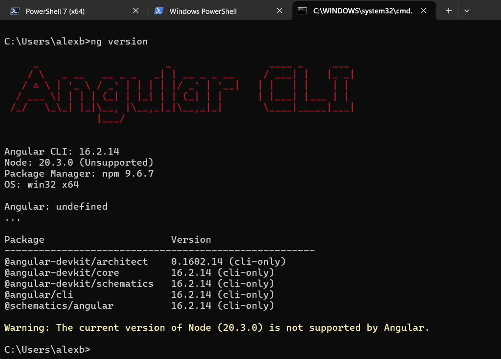
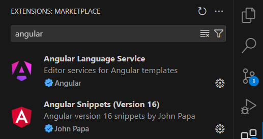

# PUESTA EN MARCHA
Vamos a ver ANGULAR 16, ya que esa y sus versiones anteriores, muy parecidas, son, con alta probabilidad, las que nos encontraremos en el mercado laboral.

## Documentación Oficial
Esta es la [documentación oficial](https://v16.angular.io/docs) de Angular en su versión 16.

## Requisitos máquina

Requiere:
- NodeJS, que incluirá npm
- Angular CLI

**npm** (Node Package Manager) es el gestor de paquetes predeterminado para Node.js. Permite a los desarrolladores instalar, compartir y gestionar dependencias y paquetes de software que facilitan el desarrollo de aplicaciones JavaScript. Con npm, puedes instalar bibliotecas y herramientas necesarias para tu proyecto, así como gestionar las versiones y actualizaciones de estas dependencias.

**Node.js** es un entorno de ejecución de JavaScript en el lado del servidor. Permite a los desarrolladores ejecutar código JavaScript fuera de un navegador, utilizando el motor V8 de Google Chrome. Con Node.js, puedes crear aplicaciones web y de servidor eficientes y escalables, gracias a su arquitectura basada en eventos y su modelo de entrada/salida no bloqueante. Es especialmente útil para construir aplicaciones de tiempo real, como chats o servidores de API, debido a su capacidad para manejar múltiples conexiones simultáneamente con un alto rendimiento.

**Angular CLI** (Command Line Interface) es una herramienta de línea de comandos que facilita la creación, desarrollo y mantenimiento de aplicaciones Angular. Proporciona comandos para generar código, ejecutar un servidor de desarrollo, realizar pruebas y construir la aplicación para producción.

-------------------------

## Preparación máquina

- Instalamps Node JS
- Instalamos CLI de forma global, con el flag ***-g***:
[Página del paquete de Angular CLI en npmjs.com](https://www.npmjs.com/package/@angular/cli/v/16.2.14)

```bash
npm install -g @angular/cli@16.2.14
```

Comprobamos la instalación y la versión instalada:

```bash
ng version
```



--------------------------------

## Crear proyecto: *¡hola mundo!*

1. Abrimos la terminal.
2. Nos ubicamos en el directorio donde queremos que se genera la carpeta del proyecto.
3. Creamos nuevo proyecto:

```bash
ng new NombreProyecto
```

Nos preguntará varias cosas:
- **autocompletado? yes** (*configura la Angular CLI para que pueda ofrecer autocompletado de comandos y opciones al escribir en la línea de comandos, facilitando el desarrollo y la navegación*)
- **add Angular Routing? yes** (*configura y genera un módulo de enrutamiento básico para tu aplicación Angular, permitiendo la navegación entre diferentes vistas o páginas dentro de la aplicación. Después habrá que configurarlo*)
- **cómo aplicarás estilos? CSS** (*selecciona CSS como el método principal para aplicar estilos a tu aplicación Angular. Otras opciones comunes son SCSS, LESS...*)

----------------------------------

## Extensiones de Visual Studio Code recomendadas

- Angular Language Service
- Angular Essentials (John Papa)



---------------------------------

## Archivos de configuración del proyecto

Una breve descripción del propósito de cada archivo en un proyecto Angular:

- **angular.json**: Contiene la configuración del proyecto Angular, incluyendo información sobre los proyectos, arquitecturas de construcción, pruebas, y opciones de configuración para el CLI de Angular. Es donde se indica el *entry point* (punto de entrada) de HTML (index.html) y de código (main.ts):

    ```json
                "index": "src/index.html",
                "main": "src/main.ts",
    ```

    También será, por ejemplo, donde configuremos los valores style y script de Bootstrap, por ejemplo:
    ```json
    "styles": [
                "./node_modules/bootstrap/dist/css/bootstrap.min.css",
                "src/styles.css"
                ],
                "scripts": [
                "./node_modules/bootstrap/dist/js/bootstrap.bundle.min.js"
                ]
    ```

- **package.json**: Define las dependencias del proyecto, scripts de ejecución, y metadatos del proyecto (como nombre, versión, descripción). Es crucial para la gestión de paquetes con npm.

- **package-lock.json**: Registra las versiones exactas de las dependencias instaladas en el proyecto, asegurando que se mantengan las mismas versiones en futuras instalaciones para mantener la consistencia del entorno de desarrollo.

- **tsconfig.json**: Configura las opciones del compilador TypeScript para el proyecto globalmente, como la versión de ECMAScript, los directorios de salida y las reglas estrictas de comprobación de tipos. Más información en el apartado de [TypeScript](../10_TYPESCRIPT.md).

- **tsconfig.app.json**: Especifica configuraciones específicas de TypeScript para la aplicación Angular. Suele extender `tsconfig.json` y se usa principalmente para la construcción del código fuente de la aplicación.

- **tsconfig.spec.json**: Define las configuraciones de TypeScript para los archivos de pruebas (spec). Suele extender `tsconfig.json` y asegura que los tests se compilen correctamente.

Estos archivos configuran y gestionan diferentes aspectos del proyecto Angular, desde la construcción y dependencia hasta la configuración del compilador TypeScript.

-------------------------

## Estructura lógica de Angular

La estructura lógica de una aplicación Angular se organiza típicamente de la siguiente manera:

### Módulo Raíz (Root Module)
El módulo raíz de una aplicación Angular se conoce como AppModule. Este módulo es esencial ya que actúa como el punto de entrada principal de la aplicación. Podremos generar otros módulos, pero tendrán que ser importados a AppModule.

### Componentes
Los componentes en Angular son los bloques fundamentales de construcción de la interfaz de usuario. Están diseñados para ser reutilizables y se componen de una plantilla HTML que define la vista y una clase TypeScript que define el comportamiento del componente.

### Servicios
Los servicios en Angular son clases que están diseñadas para ser inyectadas en otros componentes o servicios. Se utilizan para encapsular la lógica de negocio, la comunicación con el servidor (API fetch) y otras operaciones que no están directamente relacionadas con la vista.

### Directivas
Las directivas son instrucciones en el DOM que Angular aplica para transformar el comportamiento o la apariencia de un elemento HTML. Las directivas pueden ser directivas estructurales (como *ngIf y *ngFor) que afectan a la estructura del DOM, o directivas de atributo que modifican el comportamiento o el estilo de un elemento.
- Directivas de atributo (built-in):
    - NgClass: añadir o quitar conjunto de clases CSS.
    - NgStyle: añadir o quitar conjunto de estilos CSS.
    - NgModel: agrega un enlace bidireccional a un elemento form HTML.
- Directivas estructurales (built-in):
    - NgIf, NgForOf, NgSwitch
- Directivas creadas por nosotros.

### Pipes
Los pipes en Angular permiten transformar el contenido mostrado en una plantilla. Se utilizan para formatear fechas, números, cadenas de texto, entre otros.

### Enrutamiento
El enrutamiento en Angular permite navegar entre diferentes vistas o páginas dentro de la aplicación. Se configura mediante el Angular Router y se basa en la definición de rutas que coinciden con las URL y cargan los componentes correspondientes.

### Estructura Jerárquica
En la estructura jerárquica de una aplicación Angular, el AppModule sirve como el módulo raíz que importa otros módulos, define componentes, servicios, directivas y pipes. Estos componentes, servicios, directivas y pipes se organizan y se interconectan de manera lógica y estructurada para formar la funcionalidad completa de la aplicación.

Esta estructura lógica proporciona un marco sólido para desarrollar aplicaciones web dinámicas y escalables en Angular, facilitando la separación de preocupaciones y promoviendo las mejores prácticas de desarrollo.

-------------------------------

## Uso de Clases en Angular: Fundamentos de la Programación Orientada a Objetos

En Angular, el uso extensivo de clases se fundamenta en los principios de la Programación Orientada a Objetos (POO), proporcionando una estructura organizada y coherente para el desarrollo de aplicaciones web. Las clases permiten la encapsulación de datos y métodos relacionados, fomentan la reutilización del código y mejoran la mantenibilidad de las aplicaciones. Además, aprovechan las características avanzadas de TypeScript, como el tipado estático y la herencia, para asegurar un desarrollo robusto y seguro.