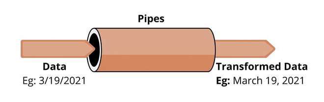

# PIPES
## Definición

Los pipes en Angular son una característica que permite transformar datos en las plantillas de una manera concisa y declarativa. Los pipes toman datos de entrada, los transforman y devuelven un valor transformado, que se puede mostrar en la vista. Son muy útiles para tareas comunes como formatear fechas, monedas, números, o cadenas de texto, y pueden ser personalizados según las necesidades de la aplicación.



Podemos hacer uso de los pipes que vienen integrados con Angular como crear nuevos pipes personalizados que cumplan con nuestros objetivos.

----

## Pipes Integrados

Los siguientes son pipes integrados habitualmente usados para dar formato a los datos:
- `DatePipe`: Formatea un valor de fecha de acuerdo con las reglas locales.
- `UpperCasePipe`: Transforma el texto a mayúsculas.
- `LowerCasePipe`: Transforma el texto a minúsculas.
- `CurrencyPipe`: Transforma un número en una cadena de texto de moneda, formateada según las reglas locales.
- `DecimalPipe`: Transforma un número en una cadena con punto decimal, formateada según las reglas locales.
- `PercentPipe`: Transforma un número en una cadena de porcentaje, formateada según las reglas locales.
- `AsyncPipe`: Suscribe y desuscribe a una fuente asincrónica, como un observable.
- `JsonPipe`: Muestra una propiedad del objeto de un componente en pantalla como JSON para depuración.

La sintaxis para usar un pipe en la plantilla HTML es muy sencilla y sigue la siguiente forma:

```html
{{ valorOriginal | nombreDelPipe }}
```

Se pueden encadenar varios pipes, y estos pueden requerir que se les pasen argumentos:

```html
{{ metros | number:'1.2-2' }}
{{ archivo.size | filesize:2 }}
```

Para más información sobre **DatePipe**, su apartado en la [documentación oficial](https://v17.angular.io/api/common/DatePipe) es completo y preciso.

### Ejemplo sencillo con UpperCasePipe

Ejemplo sencillo de aplicación de un pipe built-in, por simplificarlo se ha creado un compontente en un solo archivo (código TS y plantilla HTML en un solo archivo).

```ts
// archivo componente: my-component.ts
import { Component } from '@angular/core';

@Component({
  selector: 'app-my-component',
  template: `
    <p>Fecha de nacimiento: {{ birthdate | date:'longDate' }}</p>
  `
})
export class MyComponent {
  birthdate: Date = new Date(1990, 6, 15); // 15 de julio de 1990
}
```
### Ejemplos sencillos, más

Aplicando Built-in pipes en plantilla HTML:

```html
<div class="container">
    <h3><a href="https://angular.io/api?query=pipe" target="_blank">Pipes en Angular</a></h3>
    <p>Pipes básicos de texto</p>
    <ul>
      <li>Original: {{nombre}}</li>
      <li>Pipe uppercase: {{nombre | uppercase}}</li>
      <li>Pipe lowercase: {{nombre | lowercase}}</li>
      <li>Pipe titlecase {{nombre | titlecase}}</li>
    </ul>
  
    <p><a href="https://angular.io/api/common/DatePipe" target="_blank">Pipe date</a></p>
    <ul>
      <li>Original: {{fechaActual}}</li>
      <li>{{fechaActual | date: 'short'}}</li>
      <li>{{fechaActual | date: 'mediumDate'}}</li>
      <li>{{fechaActual | date: 'dd/MM/yyyy'}}</li>
      <li>{{fechaActual | date:'MMMM dd, yyyy'}}</li>
      <li>{{fechaActual | date:'long':'GMT-4'}}</li>
      <li>{{fechaActual | date:'long':'':'fr' }}</li>
    </ul>
  
    <p>Pipes numéricos</p>
    <ul>
      <li>Original: {{facturacion}}</li>
      <li>{{facturacion | number:'1.2-2' }}</li>
      <li>{{facturacion | currency:'EUR':'symbol-narrow':'1.4-4' }}</li>
      <li>{{porcentaje | percent:'2.2-2'}}</li>
    </ul>
  
  </div>
  
```

Valores originales:

```ts
export class AngularPipesComponent {
  nombre = 'Juan Luis ochoa';
  fechaActual = new Date();
  facturacion = 1099898.5454;
  porcentaje = 0.21;
  // ...
}
```

----

## Pipes Personalizados

Cómo generar pipes personalizados en Angular. Lo primero, generamos el pipe desde la terminal:

```bash
ng g p pipes/almacenamientoArchivosMultiple
```

Esto genera el archivo del pipe con su estructura, a la espera de que la desarrollemos:

```ts
import { Pipe, PipeTransform } from '@angular/core';

@Pipe({
  name: 'almacenamientoArchivosMultiple'
})
export class AlmacenamientoArchivosMultiplePipe implements PipeTransform {
  
  transform(value: unknown, ...args: unknown[]): unknown {
    return null;
  }

}
```

A continuación, escribimos la lógica de transformación del pipe:

```ts
import { Pipe, PipeTransform } from '@angular/core';

@Pipe({
  name: 'almacenamientoArchivosMultiple'
})
export class AlmacenamientoArchivosMultiplePipe implements PipeTransform {
  transform(bytes: number, unidad: string): number {
    switch (unidad) {
      case 'KB':
        return bytes / 1024;
      case 'MB':
        return bytes / 1024 / 1024;
      case 'GB':
        return bytes / 1024 / 1024 / 1024;
      case 'TB':
        return bytes / 1024 / 1024 / 1024 / 1024;
      default:
        return bytes;
    }
  }
}
```

Registramos valores almacenados en variables en el TS del componente:

```ts
import { Component } from '@angular/core';

@Component({
  selector: 'app-pipes-personalizados',
  templateUrl: './pipes-personalizados.component.html',
  styleUrls: ['./pipes-personalizados.component.css']
})
export class PipesPersonalizadosComponent {
  metros:number = 27850.32489;
  sizeFile:number = 23023;
  archivos = [
    {
      nombre: 'Archivo 1',
      size: 5000
    },
    {
      nombre: 'Archivo 2',
      size: 10000
    },
    {
      nombre: 'Archivo 3',
      size: 20000
    },
    {
      nombre: 'Archivo 4',
      size: 30000
    }
  ];
}
```

Y hacemos uso de nuestro nuevo Pipe en la plantilla HTML:

```html
  <table class="table table-striped">
    <thead>
      <tr>
        <th scope="col">Nombre archivo</th>
        <th scope="col">Bytes</th>
        <th scope="col">Kilobytes</th>
        <th scope="col">Megabytes</th>
        <th scope="col">GigaBytes</th>
      </tr>
    </thead>
    <tbody>
      <tr *ngFor="let archivo of archivos">
        <th scope="row">{{ archivo.nombre }}</th>
        <td>{{ archivo.size }}</td>
        <td>{{ archivo.size | almacenamientoArchivosMultiple: 'KB' | number: '1.2-2' }}</td>
        <td>{{ archivo.size | almacenamientoArchivosMultiple: 'MB' | number: '1.2-2' }}</td>
        <td>{{ archivo.size | almacenamientoArchivosMultiple: 'GB' | number: '1.2-2' }}</td>
      </tr>
    </tbody>
  </table>
```

----

## Configurar idioma por defecto en nuestra aplicación Angular

Configurar el idioma en tu aplicación Angular permite desentenderte de la configuración regional del dispositivo que accede a la página. Esto significa que la aplicación seguirá usando el idioma y las convenciones de formato que tú hayas definido, independientemente de la configuración regional o el idioma del dispositivo del usuario.
Esto es útil para formatear fechas, números, y otros datos de acuerdo con las reglas de un idioma específico. A continuación se explica cómo hacerlo paso a paso:

1. En `app.module.ts` importamos los módulos de idioma que vayamos a utilizar:
2. Luego, registramos estos datos locales en nuestra aplicación utilizando la función `registerLocaleData` del paquete `@angular/common`.
3. Configurar el idioma por defecto: proporcionamos el valor **`LOCALE_ID`** en el arreglo de providers en el módulo principal (AppModule). Esto establece el idioma que la aplicación usará de manera predeterminada.

```ts
// app.module.ts
// Cambiar el locale de la app. Cambiamos el idioma de la aplicación a nivel global
// Importar los idiomas deseados (por lo general será solo el castellano (es))
import localeEs from '@angular/common/locales/es';
import localeFr from '@angular/common/locales/fr';
// Importamos la función registerLocaleData para registrar los idiomas importados
import { registerLocaleData } from '@angular/common';

// Registro los idiomas importados
registerLocaleData(localeEs);
registerLocaleData(localeFr);
// ...
@NgModule({
  // ...
  providers: [{ provide: LOCALE_ID, useValue: 'es' }], // Configuramos el idioma por defecto de la app
  // ...
})
 ```

Al completar estos pasos, tu aplicación Angular estará configurada para utilizar el idioma español como idioma por defecto. Esto afectará cómo se formatean las fechas, los números y otros datos que dependan de la configuración regional. Si necesitas cambiar el idioma en algún momento, solo tendrás que actualizar el valor de LOCALE_ID en el proveedor correspondiente.

Esta configuración es útil para aplicaciones que se implementan en regiones específicas y necesitan respetar las convenciones locales de idioma y formato.