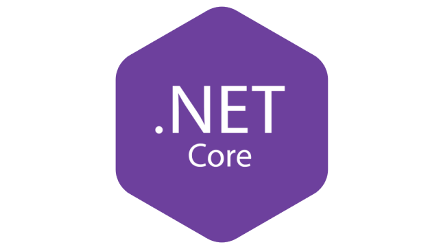
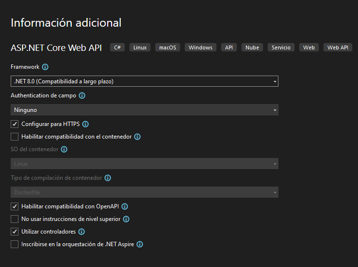

# ASP . NET Core


## Ejemplo de proyecto con ASP.NET Core

### 1. Crear BBDD y Tablas
Creamos base de datos con MS SQL Server:
```sql
--Crear una base de datos llamada MiBiblioteca con la siguiente especificación:

--Tabla Editoriales:
--	IdEditorial: Autonumérico y clave principal
--	Nombre
CREATE TABLE Editoriales (
  Id              INT           NOT NULL    IDENTITY    PRIMARY KEY,
  Nombre           NVARCHAR(100)  NOT NULL
);

--Tabla Autores:
--	IdAutor: Autonumérico y clave
--	Nombre
CREATE TABLE Autores (
  Id              INT           NOT NULL    IDENTITY    PRIMARY KEY,
  Nombre           NVARCHAR(100)  NOT NULL
);

--Tabla Libros:
--	ISBN: Clave
--	Titulo
--	Paginas
--	Precio
--	FotoPortada
--	Descatalogado: bit
--	AutorId: Especificar la relación con la tabla Autores
--	EditorialId: Especificar la relación con la tabla Editoriales
CREATE TABLE Libros (
    ISBN            INT				NOT NULL    PRIMARY KEY,
    Titulo			NVARCHAR (150)	NOT NULL,
	Paginas			INT NOT NULL,
    Precio			DECIMAL (9, 2)	NOT NULL,
	FotoPortada		NVARCHAR (MAX)	NULL,
	Descatalogado	BIT				NOT NULL,
	AutorId			INT				NOT NULL,
	EditorialId		INT				NOT NULL,
	CONSTRAINT		FK_Autores_Libros FOREIGN KEY (AutorId) REFERENCES Autores (Id),
	CONSTRAINT		FK_Editoriales_Libros FOREIGN KEY (EditorialId) REFERENCES Editoriales (Id),
);
```

### 2. Creamos proyecto de ASP Net Core Web Api en Visual Studio
Usaremos Visual Studio 2022.
Elegimos el tipo de proyecto **ASP Net Core Web Api**.
- NET 8.0
- HTTPS SI
- Compatibilidad NO
- OpenAPI SI
- Nivel superior NO
- Controladores SI
- .NET Aspier NO



### 3. Eliminamos ejemplos de WeatherForecast
En carpeta raíz y en carpeta Controllers.

### 4. Conseguir la Cadena de Conexión
Desde el *explorador de servidores*, agregamos conexión:
- Servidor: Nombre de nuestro equipo
- BBDD: MiBiblioteca
- Confiar en el certificado del servidor

Accedemos a las propiedades de la conexión, copiamos y guardamos la *cadena de conexión* para el posterior Scaffold:

```
Data Source=THINKPAD;Initial Catalog=MiBiblioteca;Integrated Security=True;Encrypt=True;Trust Server Certificate=True
```

### 5. Instalamos paquetes de Entity Framework Core
https://www.nuget.org/packages/Microsoft.EntityFrameworkCore.Tools/
https://www.nuget.org/packages/Microsoft.EntityFrameworkCore.SqlServer/
Importante que coincidan las versiones, si no no funcionará...

Se instalan desde la *Consola del Administrador de paquetes*.

Comandos para instalar los paquetes:
```
NuGet\Install-Package Microsoft.EntityFrameworkCore.Tools -Version 8.0.7
NuGet\Install-Package Microsoft.EntityFrameworkCore.SqlServer -Version 8.0.7
```

### 6. Lanzamos el proceso de SCAFFOLD
Proceso de generar automáticamente el código de las entidades y el contexto de una base de datos existente.
Esto se utiliza para crear una estructura de clases en tu proyecto que refleja las tablas y relaciones de una base de datos existente.

¿Cómo Funciona?
- Genera Clases de Entidad: Crea clases en C# que representan las tablas de la base de datos.
- Crea el Contexto de Datos: Crea una clase DbContext que gestiona las entidades y su interacción con la base de datos.

Plantilla del comando:
```bash
Scaffold-DbContext " -- aquí la cadena de conexión --" -Provider Microsoft.EntityFrameworkCore.SqlServer -OutputDir Models -NoPluralize -force -project WebAPIBiblioteca
```

Comando para la bbdd MiBiblioteca
```bash
Scaffold-DbContext "Data Source=THINKPAD;Initial Catalog=MiBiblioteca;Integrated Security=True;Trust Server Certificate=True" -Provider Microsoft.EntityFrameworkCore.SqlServer -OutputDir Models -NoPluralize -force -project WebApiBiblioteca
```

### 7. Crear controlador
- Click derecho en carpeta *Controllers*.
- Agregar Controlador...
- Controlador de API en blanco.

Damos nombre al controlador (ej.: LibrosController.cs).

### 8. Endpoint
1. Propiedad context y constructor:
```cs
private readonly MiBibliotecaContext context;

public LibrosController(MiBibliotecaContext context)
{
    this.context = context;
}
```

2. Endpoint GetLibros:
```cs
[HttpGet]
public async Task<List<Libros>> GetLibros()
{
    return await context.Libros.ToListAsync();
}
```

Habrá que hacer los USING pertinentes.

### 9. Borrar conexión del fichero MiBibliotecaContext.cs

Borramos esta línea para que la *cadena de conexión* quede fuera del archivo de código:
```cs
protected override void OnConfiguring(DbContextOptionsBuilder optionsBuilder)
#warning To protect potentially sensitive information in your connection string, you should move it out of source code. You can avoid scaffolding the connection string by using the Name= syntax to read it from configuration - see https://go.microsoft.com/fwlink/?linkid=2131148. For more guidance on storing connection strings, see https://go.microsoft.com/fwlink/?LinkId=723263.
=> optionsBuilder.UseSqlServer("Data Source=THINKPAD;Initial Catalog=MiBiblioteca;Integrated Security=True;Trust Server Certificate=True");
```

### 10. Definimos la cadena de conexión en el archivo de configuración
Lo definimos tanto en `appsettings.json` como en `appsettings.Development.json`:

```json
"ConnectionStrings": {
"DefaultConnection": "Data Source=THINKPAD;Initial Catalog=MiBiblioteca;Integrated Security=True;TrustServerCertificate=True"
}
```

### 11. Añadimos la conexión a MiBibliotecaContext
Añadimos las siguientes líneas en Program.cs justo después de generar el builder:
```cs
var connectionString = builder.Configuration.GetConnectionString("DefaultConnection");

builder.Services.AddDbContext<MiBibliotecaContext>(options =>
            options.UseSqlServer(connectionString));
```

Si quisieramos deshabilitar el TRACKING para todo el proyecto:
```cs
// ...

builder.Services.AddDbContext<MiAlmacenContext>(options =>
{
    options.UseSqlServer(connectionString);
    options.UseQueryTrackingBehavior(QueryTrackingBehavior.NoTracking);
}
);
```


### Conclusión
### Conclusión

En este ejemplo, hemos recorrido los pasos necesarios para crear una API web con ASP.NET Core que se conecta a una base de datos SQL Server utilizando Entity Framework Core. A través de este proceso, hemos abordado varios aspectos importantes de la configuración y seguridad de una aplicación web moderna. A continuación, se resumen algunos de los puntos clave:

1. **Creación y Configuración de la Base de Datos**:
   - Diseñamos y creamos las tablas necesarias para la aplicación en una base de datos SQL Server.
   - Nos aseguramos de definir las relaciones entre las tablas para reflejar correctamente el modelo de datos.

2. **Configuración del Proyecto en Visual Studio**:
   - Configuramos un nuevo proyecto de ASP.NET Core Web API en Visual Studio, prestando atención a las configuraciones relevantes como el uso de HTTPS y OpenAPI.

3. **Manejo de la Cadena de Conexión**:
   - Movimos la cadena de conexión a los archivos de configuración (`appsettings.json`), siguiendo las mejores prácticas para la seguridad de la información sensible.
   - Configuramos el contexto de datos (`MiBibliotecaContext`) para leer la cadena de conexión desde la configuración.

4. **Instalación y Configuración de Entity Framework Core**:
   - Instalamos los paquetes necesarios de Entity Framework Core para trabajar con SQL Server.
   - Utilizamos el comando `Scaffold-DbContext` para generar automáticamente las clases de entidad y el contexto de la base de datos a partir de una base de datos existente.

5. **Creación de Controladores y Endpoints**:
   - Creamos un controlador (`LibrosController`) y definimos un endpoint para obtener una lista de libros desde la base de datos.
   - Utilizamos inyección de dependencias para acceder al contexto de datos en el controlador.

6. **Buenas Prácticas de Seguridad y Rendimiento**:
   - Eliminamos la cadena de conexión del código fuente para proteger información sensible.
   - Consideramos deshabilitar el seguimiento de cambios (`QueryTrackingBehavior.NoTracking`) en consultas de solo lectura para mejorar el rendimiento.

Siguiendo estos pasos, hemos construido una base sólida para una API web robusta y segura. Este enfoque modular y basado en buenas prácticas no solo facilita el desarrollo y mantenimiento, sino que también asegura que la aplicación pueda escalar y adaptarse a futuros requerimientos y mejoras.

En resumen, al integrar correctamente ASP.NET Core con Entity Framework Core y seguir las mejores prácticas de configuración y seguridad, se puede desarrollar una aplicación web eficiente, mantenible y segura, que está lista para interactuar con bases de datos relacionales y servir datos a los clientes de manera efectiva.